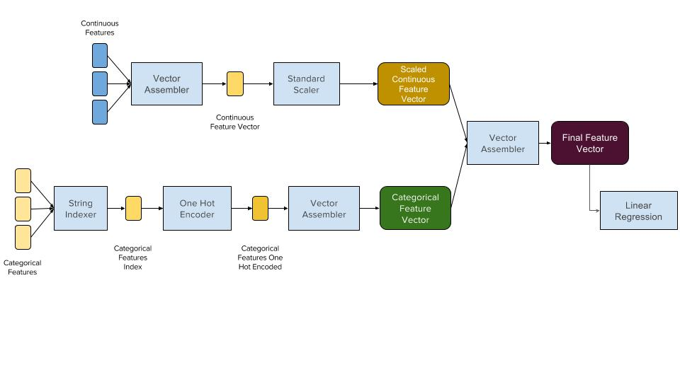

# Pipelines

Machine learning pipelines are series of transformers that execute on a
data frame. They allow us to combine our feature transformations
together with our actual predictive algorithms. Pipelines can be as
simple as a single transformer or quite complex, involving hundreds of
feature transformers and multiple predictive algorithms.

# Simple Pipeline Example

The diagram below shows a very simple pipeline that can be serialized to a bundle and then scored using MLeap Runtime. The ideas is that MLeap enables serialization and execution of transformers that operate on continuous and categorical features. A more complicated version of this pipeline may include dimension reduction transformers like PCA and feature selection tranformers like the Chi-Squared selector. 

# Advanced Pipelines

To see more advanced pipelines, please take a look at our [MLeap demo notebooks](https://github.com/combust/mleap-demo).

